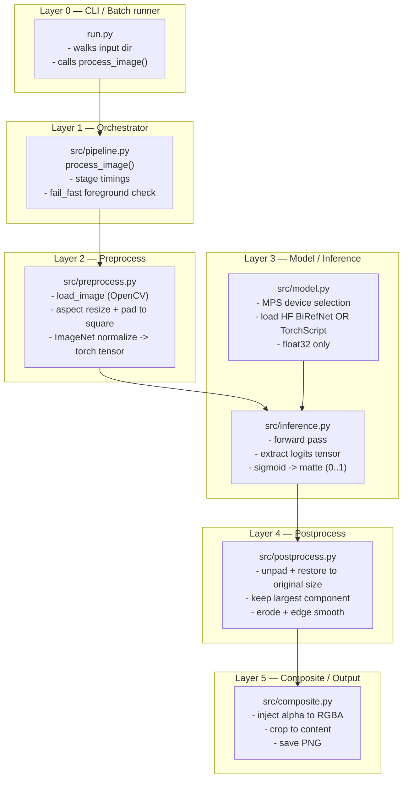
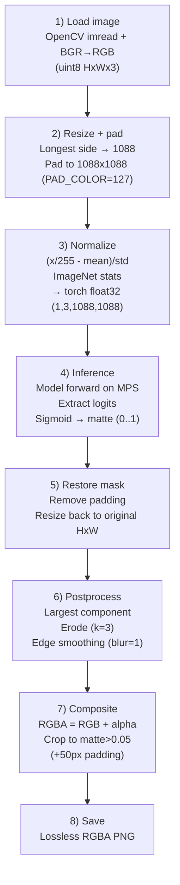

# Segmentation Pipeline Documentation (Background Removal)

This repo implements a **deterministic, local background-removal pipeline** that converts input images into **cropped RGBA PNGs** (transparent background) using a segmentation model to predict an alpha matte.

The runnable entrypoint is `bg_removal/run.py`, which iterates over images in a folder and processes them through `bg_removal/src/pipeline.py`.

---

## What this pipeline does (end-to-end)

- **Input**: RGB image files from a directory (`.jpg`, `.png`, `.webp`, …).
- **Output**: **Lossless RGBA PNGs** with:
  - predicted alpha matte injected as the PNG alpha channel
  - **auto-crop** around the foreground (with padding)
  - original directory structure preserved under the output folder

---

## High-level architecture (layers)



---

## Complete pipeline (step-by-step)

The core function is `process_image()` in `bg_removal/src/pipeline.py`. It is intentionally linear:



### Stage 1 — Image loading (`src/preprocess.py`)

- Reads image with `cv2.imread(..., IMREAD_COLOR)` and converts `BGR → RGB`.
- Ensures dtype is `uint8` and shape is `(H, W, 3)`.

### Stage 2 — Resize + padding (`src/preprocess.py`)

Goal: feed the model a fixed square input while preserving aspect ratio.

- **Target square size**: `TARGET_SIZE = 1088`
- Compute scale: `1088 / max(orig_h, orig_w)`
- Resize with:
  - `INTER_AREA` when downscaling
  - `INTER_CUBIC` when upscaling
- Pad into a `(1088, 1088, 3)` canvas filled with `PAD_COLOR = 127`
- Record offsets + scale in `PreprocessMeta` so the predicted mask can be mapped back later.

### Stage 3 — Normalize (`src/preprocess.py`)

Converts padded `uint8` RGB into model input:

- scale to `[0,1]`
- apply ImageNet normalization:
  - mean: `[0.485, 0.456, 0.406]`
  - std: `[0.229, 0.224, 0.225]`
- convert to `torch.float32` tensor shaped `(1, 3, 1088, 1088)`

### Stage 4 — Inference (`src/model.py`, `src/inference.py`)

#### Device + numeric constraints

This pipeline is designed for **Apple Silicon GPU acceleration**:

- **Device**: `torch.device("mps")`
- **Required**: `torch.backends.mps.is_available() == True` (no CPU fallback in `get_device()`)
- **Dtype**: **float32 only** (fp16 is intentionally avoided)
- **Batch size**: 1 (the code validates input shape `(1,3,H,W)`)

#### Default model

By default, `run.py` uses:

- **Hugging Face repo**: `ZhengPeng7/BiRefNet`
- **Loader**: `transformers.AutoModelForImageSegmentation.from_pretrained(...)`
- **Configuration** (from code):
  - `trust_remote_code=True`
  - `low_cpu_mem_usage=False`
  - `_fast_init=False`
  - `device_map=None`
  - model moved to `mps` and cast to `float32`

#### Output handling

Segmentation models can return different structures (tensor, tuple/list, dict/ModelOutput). The pipeline:

- extracts the “primary” tensor (prefers `.logits` / common keys, otherwise last tensor-like value)
- ensures the output becomes a single-channel map shaped `(1088, 1088)`
- applies `sigmoid()` to convert **logits → probability matte**
- returns a `numpy.float32` matte in `[0,1]`

### Stage 5 — Post-processing (`src/postprocess.py`)

#### 5.1 Restore mask to original image space

The model predicts a **square matte** in model-space. To map it back:

- remove padding using `x_offset / y_offset` and the resized dimensions
- resize to `(orig_w, orig_h)` with bilinear interpolation

#### 5.2 Cleanups

Applied in original image resolution:

- **Largest connected component** (removes small dust blobs)
  - threshold used: `ALPHA_THRESHOLD = 0.05`
- **Erosion** (shrinks mask slightly to reduce halo artifacts)
  - `ERODE_KERNEL_SIZE = 3` (set to `0` in config to disable)
- **Edge smoothing**
  - detect edges via Canny (on matte and on a binary-thresholded matte)
  - dilate an “edge band”
  - blend a Gaussian-blurred matte into original matte only inside that band
  - `EDGE_BLUR_RADIUS = 1`

### Stage 6 — Composite + save (`src/composite.py`)

- Create RGBA by injecting alpha into the **original RGB image**.
- Compute a crop around pixels where `alpha > 0.05`:
  - add `CROP_PADDING = 50` pixels of padding
- Save output as a **lossless RGBA PNG**.

### Foreground sanity check (`src/pipeline.py`)

After post-processing, the pipeline checks if there is any meaningful foreground:

- compute fraction of pixels where `matte > 0.05`
- if it is `< 0.001`, it raises (default `fail_fast=True`)

---

## Model options

### Option A (default): Hugging Face BiRefNet (recommended)

Used when `--model` is:

- `hf:ZhengPeng7/BiRefNet` (default)
- `hf:birefnet`
- `birefnet`

### Option B: Local TorchScript model

If `--model` is a file path (not starting with `hf:`), the pipeline expects a model saved via `torch.jit.save()` (TorchScript archive).

Key constraints from the loader (`src/model.py`):

- loads on **CPU first** then moves to **MPS**
- forces **float32** everywhere (helps avoid MPS failures on float64 attributes)
- requires TorchScript (pure `state_dict` checkpoints are not supported by design)

### Export helper (TorchScript)

`bg_removal/get_model.py` can trace BiRefNet on CPU into a TorchScript file:

- trace resolution defaults to `1088` (must match `TARGET_SIZE`)
- wraps the model so TorchScript output is a single logits tensor
- includes workarounds to avoid “meta tensor” init paths and TorchScript name issues

---

## Configuration reference

All centralized in `bg_removal/src/config.py`:

| Name | Value | Meaning |
|---|---:|---|
| `TARGET_SIZE` | `1088` | Model input square size (also used to enforce output matte size) |
| `PAD_COLOR` | `127` | RGB value used to fill padded regions |
| `ALPHA_THRESHOLD` | `0.05` | Foreground threshold for sanity check + cropping + LCCA |
| `CROP_PADDING` | `50` | Extra padding (pixels) added around the crop bounding box |
| `EDGE_BLUR_RADIUS` | `1` | Edge-only smoothing blur radius |
| `ERODE_KERNEL_SIZE` | `3` | Matte erosion kernel size (set to 0 to disable) |
| `IMAGENET_MEAN/STD` | standard | Normalization constants used before inference |

---

## How to run

### Install dependencies

Dependencies are listed in `bg_removal/requirements.txt` (PyTorch + OpenCV + Transformers, etc.).

```bash
python -m venv bg_removal/.venv
source bg_removal/.venv/bin/activate
pip install -r bg_removal/requirements.txt
```

Notes:
- This pipeline expects a PyTorch build with **MPS support**.
- It runs **batch=1, float32** on **Apple Silicon** (`mps`).

### Run background removal on a folder

```bash
python bg_removal/run.py --input bg_removal/input --output bg_removal/output
```

### Use a TorchScript model instead of HF

```bash
python bg_removal/run.py \
  --input bg_removal/input \
  --output bg_removal/output \
  --model bg_removal/models/birefnet.torchscript
```

### Export BiRefNet to TorchScript (optional)

```bash
python bg_removal/get_model.py \
  --out bg_removal/models/birefnet.torchscript \
  --input-res 1088
```

---

## Output behavior and expectations

- **Output format**: RGBA PNG (lossless).
- **Auto-crop**: output is cropped to foreground region (plus padding), so output dimensions are usually smaller than input.
- **Failure mode**: if no foreground is detected, the pipeline raises (by default) to prevent silently producing empty cutouts.

